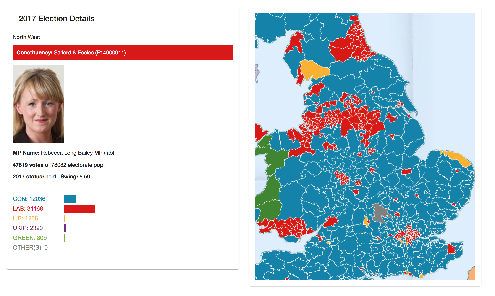
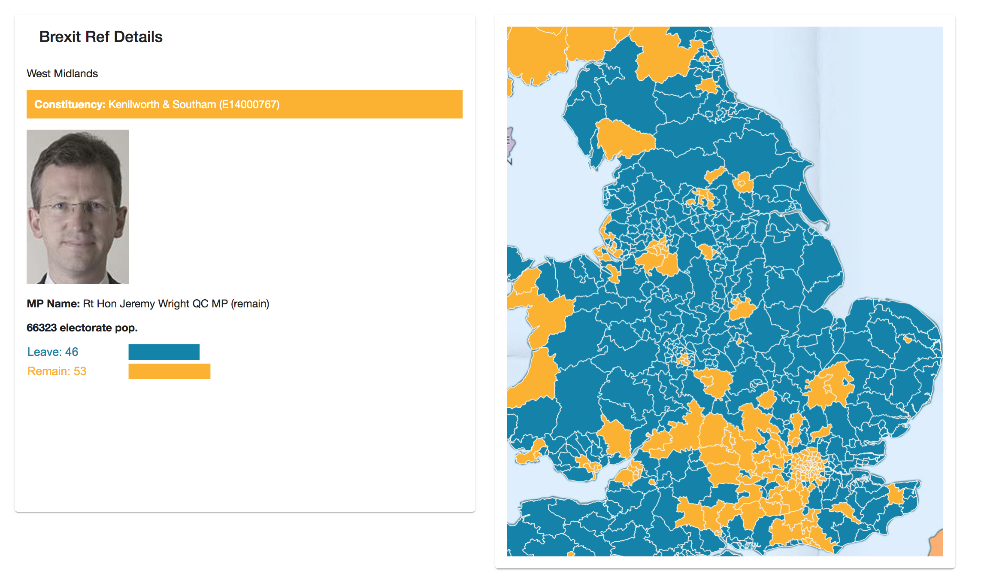

# NgD3mapGisBrexitRef

GIS project written in TypeScript and with Angular 8 framework. Without political intent, render of OpenLayers map of the UK, each constituency colour-coded by victor, and d3 bar chart of votes. Neutrally displayed data: results of elections (2017 and 2019), referendum (Brexit), and petitions (Brexit). Hover shows local MP.

## Routes

### /ref/brexit
  

Government data is by local authority, which gives no idea of how an MP's area voted - here I present data regrouped by Parliamentary constituency.

### /petition/brexit
  

### /election/[year] e.g. 2017
  

This project was generated with [Angular CLI](https://github.com/angular/angular-cli) version 8.1.1.

## Development server

Run `ng serve` for a dev server. Navigate to `http://localhost:4200/`. The app will automatically reload if you change any of the source files.

## Code scaffolding

Run `ng generate component component-name` to generate a new component. You can also use `ng generate directive|pipe|service|class|guard|interface|enum|module`.

## Build

Run `ng build` to build the project. The build artifacts will be stored in the `dist/` directory. Use the `--prod` flag for a production build.

## Running unit tests

Run `ng test` to execute the unit tests via [Karma](https://karma-runner.github.io).

## Running end-to-end tests

Run `ng e2e` to execute the end-to-end tests via [Protractor](http://www.protractortest.org/).

## Further help

To get more help on the Angular CLI use `ng help` or go check out the [Angular CLI README](https://github.com/angular/angular-cli/blob/master/README.md).
